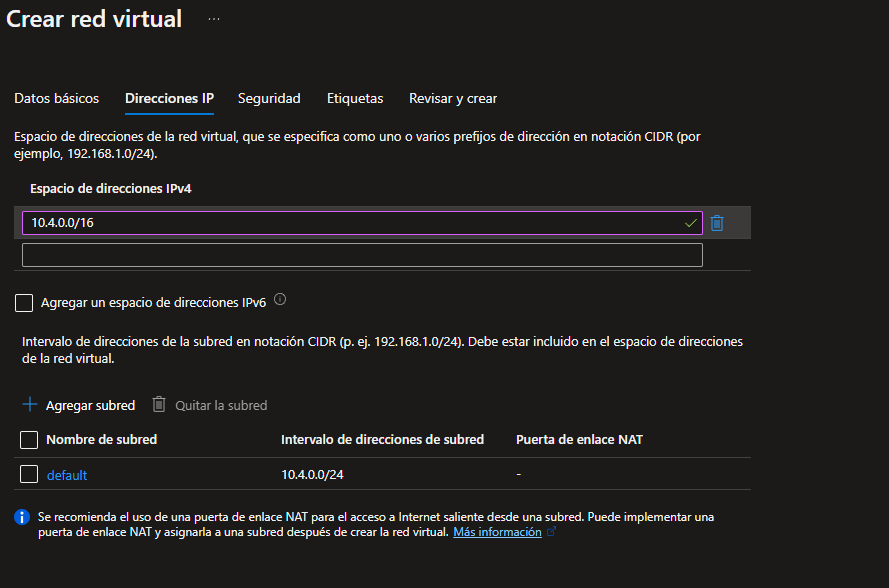

# Creating a Virtual Network in Azure

Vamos a crear una red virtual implementando dos máquinas virtuales y luego las configuraremos para permitir que un máquina virtual haga ping a la otra dentro de esa red.

### Crear Red Virtual

------

**PASO 1:** Iniciar sesión en Azure Portal [https://portal.azure.com](https://portal.azure.com/)

**PASO 2:** Desde la pantalla de inicio de Azure nos dirigimos a **Todos los servicios** y buscamos **Redes Virtuales** y hacemos click en **Crear**.

**PASO 3:** En **Datos básicos** tenemos que insertar los siguientes datos:

| Configuración                    | Valor                     |
| :------------------------------- | :------------------------ |
| **Nombre**                       | vnet1                     |
| **Espacio de direcciones**       | 10.4.0.0/16               |
| **Suscripción**                  | Seleccione su suscripción |
| **Grupo de recursos**            | myRGVNet (crear nuevo)    |
| **Ubicación**                    | (EE. UU.) Este de EE. UU. |
| **Subred - Nombre**              | default                   |
| **Rango de dirección de subred** | 10.4.0.0/24               |


En direcciones IP tendremos que cambiar también algunos datos.



**PASO 4:** Haga clic en el botón **Revisar y crear**. Asegúrese de que la validación sea correcta.

**PASO 5:** Haga clic en el botón **Crear** para implementar la red virtual.

### Crear dos Máquinas Virtuales

------

Vamos a crear dos máquinas virtuales.

**PASO 1:** Desde la pantalla de inicio nos vamos a **Todos los servicios**, buscamos **Maquinas virtuales** y luego hacemos clic en **Crear**.


**PASO 2:** En la pestaña **Datos básicos**, completaremos los siguientes datos:

| Configuración                        | Valor                                     |
| ------------------------------------ | ----------------------------------------- |
| **Suscripción**                      | Elija su suscripción                      |
| **Grupo de recursos**                | myRGVNet                                  |
| **Nombre de la máquina virtual**     | vm1                                       |
| **Región**                           | (EE. UU.) Este de EE. UU.                 |
| **Imagen**                           | Centro de datos de Windows Server 2019    |
| **Nombre de usuario**                | azureuser                                 |
| **Contraseña**                       | Pa$$w0rd1234                              |
| **Puertos de entrada públicos**      | Seleccione Permitir puertos seleccionados |
| **Puertos de entrada seleccionados** | RDP (3389):                               |


**PASO 3:** Seleccione la pestaña **Redes**. Asegúrese de que la máquina virtual esté ubicada en la red virtual creada anteriormente vnet1.

| Configuración   | Valor |
| --------------- | ----- |
| **Red virtual** | vnet1 |

**PASO 4:** Haga clic en **Revisar y crear**. Después de que la validación sea exitosa, haga clic en **Crear**. 

**PASO 5:** Cree una segunda máquina virtual repitiendo los pasos anteriores. Asegúrese de usar un nombre de máquina virtual diferente, que la máquina virtual esté dentro de la misma red virtual y que esté usando una nueva dirección IP pública:

| Configuración                    | Valor          |
| -------------------------------- | -------------- |
| **Grupo de recursos**            | myRGVNet       |
| **Nombre de la máquina virtual** | vm2            |
| **Red virtual**                  | vnet1          |
| **IP pública**                   | (nuevo) vm2-ip |

### Probar la Conexión

------

Permitiremos conexiones ICMP y probaremos si las máquinas virtuales pueden comunicarse (hacer ping) entre sí.

**PASO 1:** Desde la pantalla de **Todos los recursos**, buscamos **vm1**, abrimos la pestaña **Visión general** y asegúrese de que su **Estado** sea **Ejecutándose**. Es posible que necesite **Actualizar** la página.

**PASO 2:** En la página **Información general**, hacemos clic en el botón **Conectar**.

**PASO 3:** En la página **Conectar a la máquina virtual**, mantenemos las opciones predeterminadas en conectarse por dirección IP a través del puerto 3389 y hacemos clic en **Descargar archivo RDP**.

**PASO 4:** Abrimos el archivo RDP descargado y haga clic en **Conectar** cuando se le solicite.

**PASO 5:** En la ventana **Seguridad de Windows**, escribimos el nombre de usuario **azureuser** y la contraseña **Pa$$w0rd1234** y luego hacemos clic en **Aceptar**.

**PASO 6:** Hacemos clic en **Sí** y nos conectamos a su VM implementada. Deberíamos conectarnos correctamente.

**PASO 7:** Abrimos un símbolo del sistema de PowerShell en la máquina virtual haciendo clic en el botón **Inicio**, escribiendo **PowerShell**, haciendo clic con el botón derecho en **Windows PowerShell** en el menú del botón derecho y seleccionando **Ejecutar como administrador**.

**PASO 8:** Intente hacer ping a vm2 (asegúrese de que vm2 se esté ejecutando). Recibirá un error que indica que la solicitud ha excedido el tiempo de espera. El `ping` falla porque usa el **Protocolo de mensajes de control de Internet (ICMP)**. De forma predeterminada, ICMP no está permitido a través del firewall de Windows.

**PASO 9:** Conectar a **vm2** mediante RDP.

**PASO 10:** Abrimos el aviso de **PowerShell** y habilitamos el ICMP. Este comando permite conexiones entrantes ICMP a través del firewall de Windows.

```
New-NetFirewallRule –DisplayName “Allow ICMPv4-In” –Protocol ICMPv4
```


**PASO 11:** Una vez que habilitamos el **ICMP** en las dos maquinas virtuales ya podremos hacer **ping** entre ellas.

**PASO 12:** En la maquina **vm1** hacemos `ping vm2` y en la maquina **vm2** hacemos `ping vm1`.


Para evitar costes adicionales, puede quitar este grupo de recursos. Busque grupos de recursos, haga clic en su grupo de recursos y, a continuación, haga clic en **Eliminar grupo de recursos**. Compruebe el nombre del grupo de recursos y luego haga clic en **Eliminar**. Supervise las **Notificaciones** para ver cómo se realiza la eliminación.